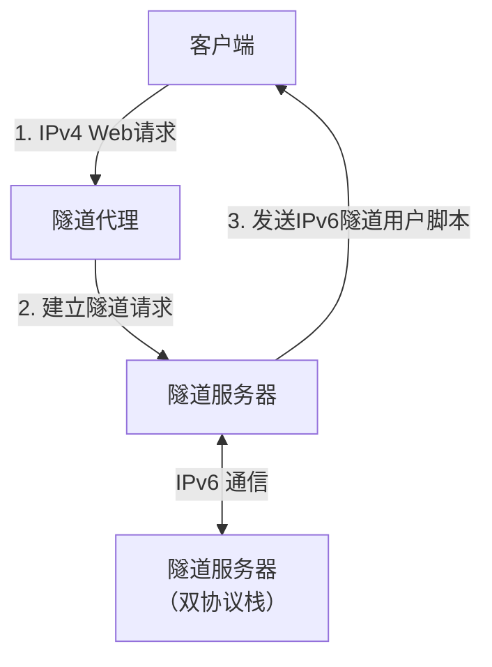
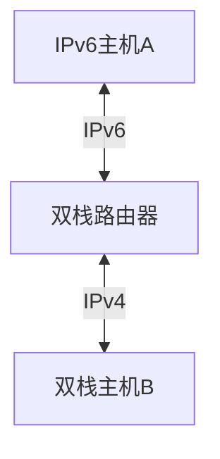

> IPv6在普遍部署前应考虑兼容IPv4,目前通用的过渡方法分3种，即：
> - 隧道技术：用于解决IPV6节点之间通过 IPV4网络进行通信的问题
> - 协议翻译技术:使得纯IPv6节点与纯IPV4节点之间可以进行通信
> - 双协议栈技术:使得IPV4和IPV6可以共存于同一设备和同一网络中

### 5.3.1 隧道技术（tunnel）
目前主要的隧道技术有以下四种：
- 主机到主机的隧道
- 主机到路由器的隧道
- 路由器到路由器的隧道
- 路由器到主机的隧道

1.隧道中介技术（Tunnel Broker）

> 隧道中介是一种用于简化 IPv6 过渡的技术，特别适用于大型网络中自动配置隧道的情况
> 它通过隧道服务器（Tunnel Broker）实现 IPv6 分组的传输，支持双协议栈主机通过 IPv4 网络接入 IPv6 网络

> **主要特点**：
> - 即插即用：客户端通过请求自动获取隧道配置，无需手动干预。
> - 适用场景：适合大规模网络部署，避免人工配置隧道的高成本。
> - **技术要求**：
>   - 客户端必须支持双协议栈（IPv4/IPv6）。
>   - 客户端必须拥有全局唯一的 IPv4 地址（不能位于 NAT 之后）。

这是通过隧道服务器配置隧道端点的方法，此IPv4地址为全局地址，不能[NAT](https://zh.wikipedia.org/wiki/%E7%BD%91%E7%BB%9C%E5%9C%B0%E5%9D%80%E8%BD%AC%E6%8D%A2)转换：

2.自动隧道

> 两个双栈主机可以通过自动隧道在IPV4网络中进行通信
> 下图是自动隧道的网终拓扑
> 实现自动隧道的节点必须采用IPv4兼容的IPv6地址

> 在上图中，地址分配如下:
> - 从主机A到主机B的分组:源地址IPV6 &rarr; 目标地址0::IPv4(B)
> - 从路由器到主机B的隧进:派地址IPv4 &rarr; 目标地址IPv4
> - 从主机B到路由器的隧道:源地址IPv4 &rarr; 目标地址IPv4
> - 从主机B到主机A的分班:源地址0::IPV4(B) &rarr; 目标地址IPv6

